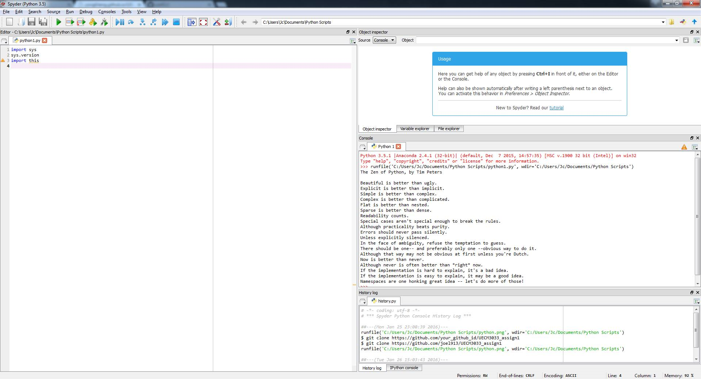

UECM3033 Assignment #1 Report
========================================================

- Prepared by: Chur Jian Chang
- Tutorial Group: T2

--------------------------------------------------------

## Task 1 -- setup a github repository

The reports, codes and supporting documents are uploaded to Github at: 

[https://github.com/joel913/UECM3033_assign1](https://github.com/joel913/UECM3033_assign1)

---------------------------------------------------------

## Task 2 -- setup python

------------------------------------------------------------

## Task 3 -- modify and run Python script

My Student ID: 1201431

Hexadecimal representation of 1201431 is 0x125517

$$\int\limits_{0}^{\infty} e^{-\sqrt{x}} dx = 2$$

Integral =  2

The 10 linear equations with unique solution are as below:

\begin{align*}
X_1 + X_2 + X_3 + X_4 + X_5 + X_6 + X_7 + X_8 + X_9 + X_10 &= 55,\\

X_1 + 2 X_2 + 3 X_3 + 4 X_4 + 5 X_5 + 6 X_6 + 7 X_7 + 8 X_8 + 9 X_9 &= 285,\\

3 X_1 + 4 X_2 + 6 X_3 + 8 X_4 + 11 X_5 + 2 X_6 + 7 X_7 + 10 X_8 &= 257,\\

2 X_1 + X_2 + 7 X_3 + 9 X_4 + X_5 + 12 X_6 + 3 X_7 &= 159,\\

4 X_1 + 3 X_2 + X_3 + 6 X_4 + 7 X_5 + 9 X_6 &= 126,\\

5 X_1 + 6 X_2 + 7 X_3 + 10 X_4 + 11 X_5 &= 133,\\

X_1 + X_2 + 4 X_3 + 5 X_4 &= 35,\\

X_1 + 10 X_2 + 3 X_3 &= 30,\\

10 X_1 + 11 X_2 &= 55,\\

12 X_1 &= 12.
\end{align*}

Solution =  [  1   2   3   4   5   6   7   8   9  10]

X_1 = 1; X_2 = 2; X_3 = 3; X_4 = 4; X_5 = 5; X_6 = 6; X_7 = 7; X_8 = 8; X_9 = 9; X_10 = 10

-----------------------------------

last modified: 27/1/2016
